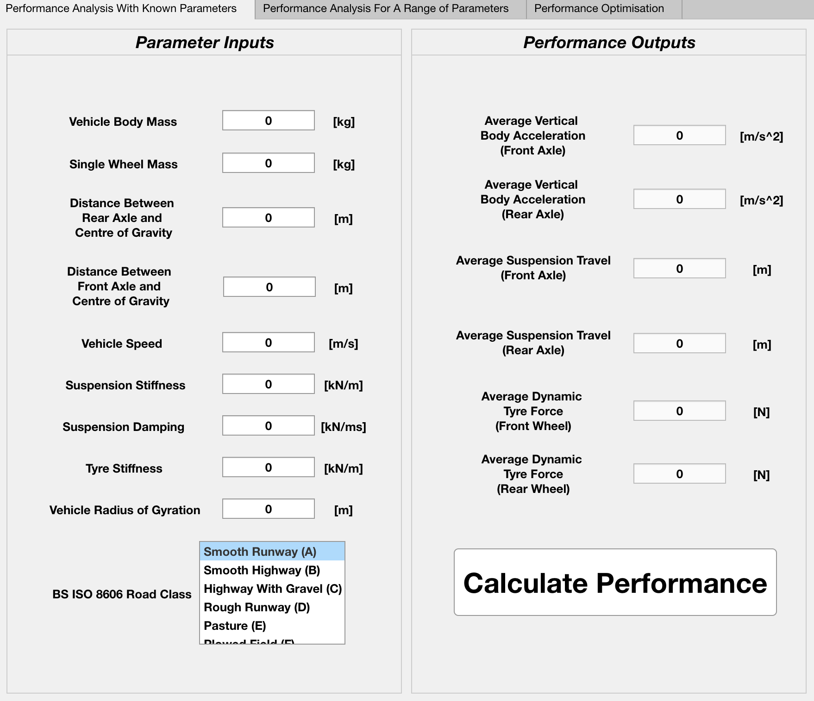
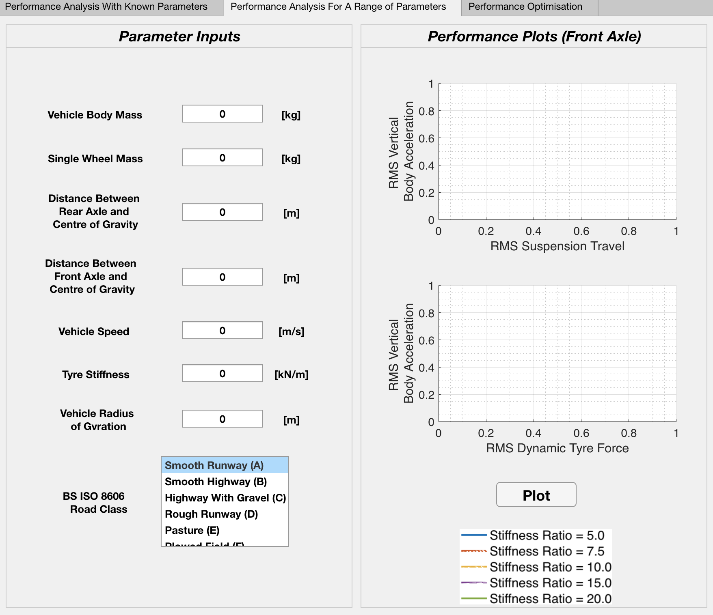
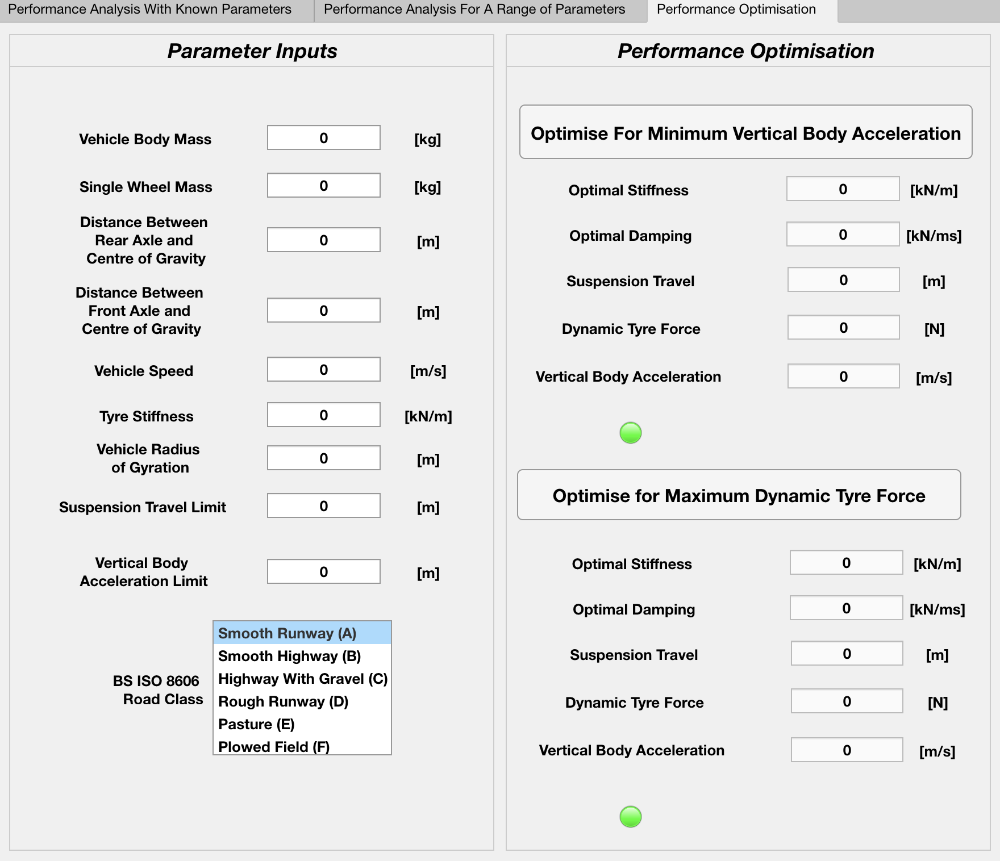

# SuspensionPerformanceApp

This application is a further development of my final year project (Performance studies in vehicle suspension systems) for the degree of: BEng Mechanical Engineering at the University of Nottingham.

The suspension performance application is a simple MATLAB application for vehicle suspension performance analysis and parameter optimisation.

The optimisable paramters are the stiffness and damping constants/coefficients of the vehicle suspension system.

All calculations are performed using the four degree-of-freedom half vehicle model. 
Unless stated otherwise, values obtained are those of the front axle of the vehicle.

The programming software: MATLAB is required to run this application.

The .mlappinstall file is for installing the application within Matlab's applications folder. With this, the application can be accessed in Matlab under the 'Apps' tab. 

To install the Matlab application:

1. Open Matlab and navigate to the 'APPS' tab. 
2. Click on the 'Install App' button.
3. Select the .mlappinstall file that you have just downloaded.
4. Complete the installation wizard.

Author - Gabriel Grant

Author Email - gabe.grant07@gmail.com

All rights reserved.

