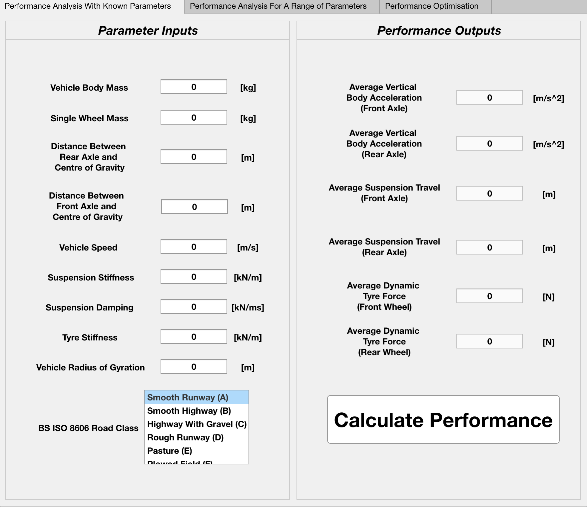

# SuspensionPerformanceApp
Conducting performance studies in vehicle suspension systems

These files are further developments of my final year project (title above) for the degree of BEng Mechanical Engineering at the University of Nottingham

The suspension performance application is a simple application for vehicle suspension performance analysis and parameter optimisation

The optimisable paramters are the stiffness and damping constants/coefficients of the vehicle suspension system

The .mlappinstall file is for installing the application with Matlab's applications folder. With this, the app can be accessed within Matlab under the 'Apps' tab. 

To install the Matlab application:

1. Open Matlab and navigate to the 'APPS' tab 
2. Click on the 'Install App' button
3. Select the .mlappinstall file that you have just downloaded
4. Complete the installation wizard

Author - Gabriel Grant

Author Email - gabe.grant07@gmail.com

All rights reserved

